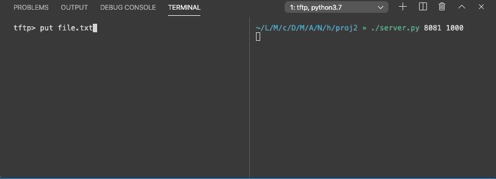

# tftp-server

This is an implementation of the [Trivial File Transfer Protocol](https://en.wikipedia.org/wiki/Trivial_File_Transfer_Protocol); a file-transfer protocol that runs over UDP and that is used as a lightweight alternative to FTP. As described in [RFC 1350](https://tools.ietf.org/html/rfc1350), the server takes as input read requests (RRQ) or write requests (WRQ) and then transfers file contents in lock-step using a series of DATA/ACK packets.

The server is multithreaded and can take on any number of client requests. Therefore it is capable of simultaneous file transfers.

Since the protocol relies on UDP, the connection is inherently unreliable. Thus it is essential to use the sequence numbers of the DATA/ACK packets in case said packets are lost or come in out of order. If the expected sequence number doesn't arrive by a specified timeout, the server will repeatedly retry sending its last packet with the last received sequence number.

The linux [tftp](https://linux.die.net/man/1/tftp) client is one way to connect to the server. This particular server implementation only accepts binary mode; all other modes will return an error.

See this example "put" request:

